# models 模型架构汇总

> 范围：汇总 `models/` 目录下的模型架构，另包含 `ConvCompression/cuSZ-Hi` 和传统方法 nvJPEG。
>
> 说明：本文根据各模型仓库的 README 和本地可读源码整理；架构图使用 Mermaid，可在 GitHub、VS Code 插件或支持 Mermaid 的 Markdown 预览器中渲染。

## 总览表

| 模型目录 | 任务类型 | 主体架构 | 熵模型 / 概率模型 | 时序 / 上下文建模 | 主要源码 |
|---|---|---|---|---|---|
| `CAESAR` | 科学时空数据压缩 | 两个版本：CAESAR-V 使用带尺度超先验和超分模块的 VAE 风格学习式压缩器；CAESAR-D 只压缩关键帧，再用潜空间扩散重建缺失帧。 | `FlexiblePrior` + range coding 编码 latent 和 hyper-latent；神经重建后还有 PCA/GAE 风格的误差界后处理修正。 | CAESAR-V 直接压缩 3D 数据块；CAESAR-D 存储关键帧 latent，并用 3D U-Net Gaussian diffusion 在关键帧之间插值 latent。 | `CAESAR/compressor.py`, `CAESAR/models/compress_modules3d_mid_SR.py`, `CAESAR/models/keyframe_compressor.py`, `CAESAR/models/video_diffusion_interpo.py`, `README.md` |
| `CRA5` | 科学气象数据极端压缩 | VAEformer：基于 ViT backbone 的 VAE + Mean-Scale Hyperprior。Encoder/Decoder 用 12 层 window attention transformer，将 268 通道 721×1440 ERA5 数据压缩为 compact latent，直接处理全部通道无需分组。 | EntropyBottleneck (factorized) 编码 hyper-latent z；GaussianConditional 编码 latent y。RANS 算术编码。 | 图像模型（逐帧压缩），无视频时序。通过 patch embedding 将 268 通道同时映射到 1024 维，window attention 在 3 种窗口尺寸 (24×24, 12×48, 48×12) 间轮换捕获多尺度空间上下文。 | `cra5/models/vaeformer/vaeformer.py`, `cra5/models/vaeformer/vit_nlc.py`, `cra5/models/vaeformer/baseline.py`, `cra5/models/compressai/`, `README.md` |
| `DCAE` | 学习式图像压缩 | Dictionary-based Cross Attention Entropy model。分析/合成变换由残差瓶颈下采样/上采样块、Swin 风格窗口注意力和卷积 GLU 块组成。 | 超先验预测 latent 均值/尺度；`y` 按通道切片，每个 slice 使用可学习字典交叉注意力、Gaussian conditional 编码和 latent residual prediction。 | 图像模型，没有视频时序；上下文主要来自通道 slice 支持、字典先验和超先验。 | `DCAE/models/dcae.py`, `README.md` |
| `DCMVC` | 学习式视频压缩 | Deep Context Modulation 视频编解码器。包含运动估计、运动矢量编码、Offset Diversity 对齐、特征/上下文融合、条件残差编码器/解码器，以及 I-frame 图像压缩器。 | 运动矢量和残差/context latent 各自有 hyperprior/spatial-prior 路径；通过自定义 RANS 工具做算术编码。 | 显式光流 + 像素域/特征域上下文调制；多尺度上下文在 P-frame 条件编码前融合。 | `DCMVC/src/models/DCMVC_model.py`, `DCMVC/src/models/image_model.py`, `README.md` |
| `DCVC` | 实时学习式视频压缩 + DCVC-family 变体 | DCVC-RT 主代码强调低运行开销：pixel-unshuffle 低分辨率 latent、depthwise-conv block、隐式时序建模、类似 module bank 的量化控制；同时包含 intra-frame 图像编码器。 | hyperprior + temporal prior + spatial prior 融合；I-frame 使用 4-part spatial prior，P-frame 使用 2-part prior。 | 使用 decoded picture buffer、自适应参考特征、temporal prior encoder 和 feature extractor，RT 路径中避免重型显式运动模块。 | `DCVC/src/models/video_model.py`, `DCVC/src/models/image_model.py`, `DCVC/README.md`, `DCVC/DCVC-family/README.md` |
| `LIC-HPCM` | 学习式图像压缩 | Hierarchical Progressive Context Modeling。Base/Large 版本使用学习式分析/合成变换，并对 latent 空间分区执行分层编码调度。 | 学习式 hyper mean/scale + Gaussian entropy estimation + progressive context fusion；latent 在 S1/S2/S3 阶段分别用 2-part、4-part、8-part mask 编码。 | 图像模型；通过分层 mask 编码和当前/历史 context 状态之间的 cross-attention 捕获长程上下文。 | `LIC-HPCM/src/models/HPCM_Base.py`, `LIC-HPCM/src/models/HPCM_Large.py`, `LIC-HPCM/src/models/HPCM_Base_PhiContext.py`, `README.md` |
| `LIC_TCM` | 学习式图像压缩 | Mixed Transformer-CNN 架构。分析/合成变换交替使用残差下采样/上采样和 `ConvTransBlock` / Swin 风格窗口注意力块。 | 超先验预测 latent 的 scale/mean；channel-wise entropy model 将 `y` 切成多个 slice，并使用 SWAtten 增强 support 后做 Gaussian conditional 编码和 latent residual prediction。 | 图像模型；上下文来自超先验和已重建的前序通道 slice。 | `LIC_TCM/models/tcm.py`, `README.md` |
| `RwkvCompress` | 学习式图像压缩 | LALIC：在分析/合成变换和 hyperprior 变换中使用 Bi-RWKV 线性注意力块的图像压缩模型。 | ELIC 风格 hyperprior + channel groups + space-channel context model；RWKV-SCCTX 融合通道上下文、checkerboard 空间上下文和超先验参数。 | 图像模型；上下文是 spatial-channel latent context，不涉及视频时序。 | `RwkvCompress/models/lalic.py`, `README.md` |
| `WeConvene` | 学习式图像压缩 | Wavelet-domain convolution and entropy model。基于 TCM 风格 LIC，将部分残差下采样/上采样路径替换为 DWT/IDWT 小波域模块。 | WeChARM 风格小波域 channel-wise autoregressive entropy model；低频和高频系数分别使用独立 Gaussian conditional。 | 图像模型；先编码低频，再让高频依赖低频重建结果和前序高频 slice。 | `WeConvene/model/tcm_wave_residual_two_entropy_modified_y_downsample_8.py`, `README.md` |
| `cuSZ-Hi` (ConvCompression) | 科学数据 GPU 误差界有损压缩 | 基于预测-量化-熵编码范式：多层三次样条插值 (Spline3D) 作预测器，量化残差为有限范围整数，后缀 Huffman/TCMS 熵编码。CUDA 全 GPU 运行，支持 HIP/oneAPI 后端。 | Huffman 编码路径（默认 `-s cr`）：GPU histogram + Huffman codebook + RTR (RLE+TCMS+RZE) 二次压缩；无 Huffman 路径（`-s tp`）：TCMS + BIT + RRE。误差界保证绝对/相对误差不越界。 | 多层层次插值：2D 数据 6 级 (64x64 anchors)、3D 数据 4 级 (16x16x16 anchors)。每级计算 anchor，插值中间值，不可预测点作为 outlier 稀疏存储。自动调参 (auto-tuning) 选择最优 alpha/beta/natural-spline/reverse。 | `src/kernel/spline3.cu`, `src/kernel/detail/spline3_md.inl`, `src/pipeline/compressor.inl`, `include/compressor.hh`, `README.md` |
| `nvJPEG` (传统方法) | 图像/视频帧 JPEG 压缩 baseline | NVIDIA GPU 加速 JPEG 编解码器。标准 JPEG 管线：8×8 DCT → 均匀量化 → 之字形扫描 → Huffman 熵编码。支持 baseline/progressive/optimized JPEG modes，灰度及 YUV/RGB interleaved/planar 格式。仅适用 uint8 图像域。 | 标准 JPEG 熵编码：对 DC 系数做 DPCM + Huffman，对 AC 系数做 run-length + Huffman。量化表控制压缩率/质量 trade-off（1-100 quality）。CUDA 并行：多帧/多 tile 同时编解码。 | 无。逐帧独立 JPEG 压缩，不利用帧间/通道间上下文。对图像数据集 (Kodak, UVG frames) 作图像 baseline；对科学数据仅作可视化 baseline，因 float→uint8 映射会引入不可逆量化误差。 | NVIDIA nvJPEG CUDA library (`nvjpegEncoder`, `nvjpegDecoder`)，项目中作为传统方法对比参考，参见 `docs/` 中基线方案。 |

## 架构图总览

### CAESAR

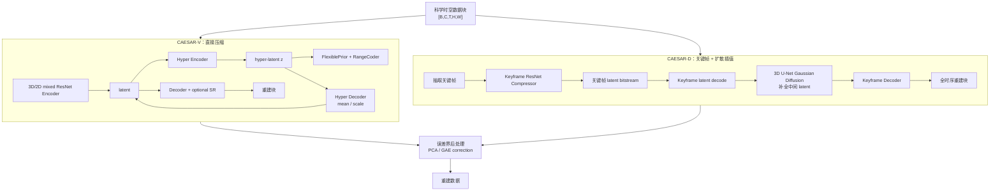

### CRA5

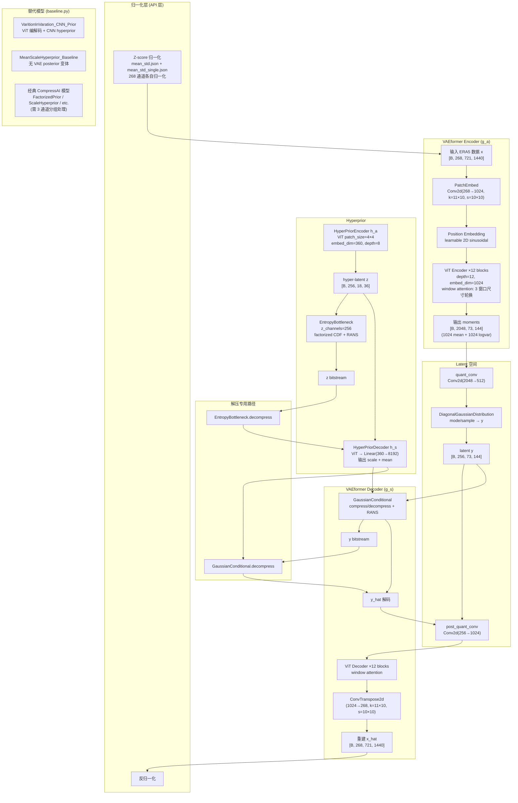

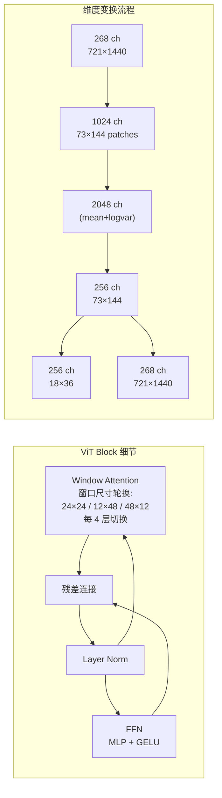

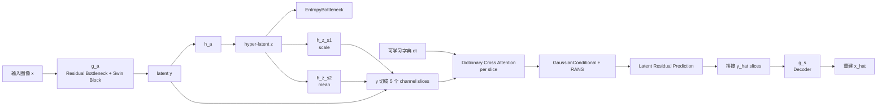

### DCMVC

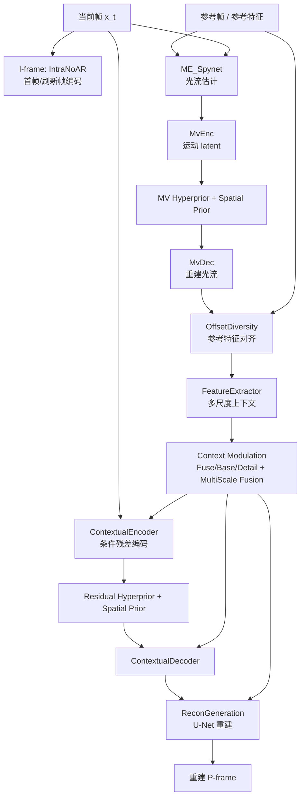

### DCVC / DCVC-RT

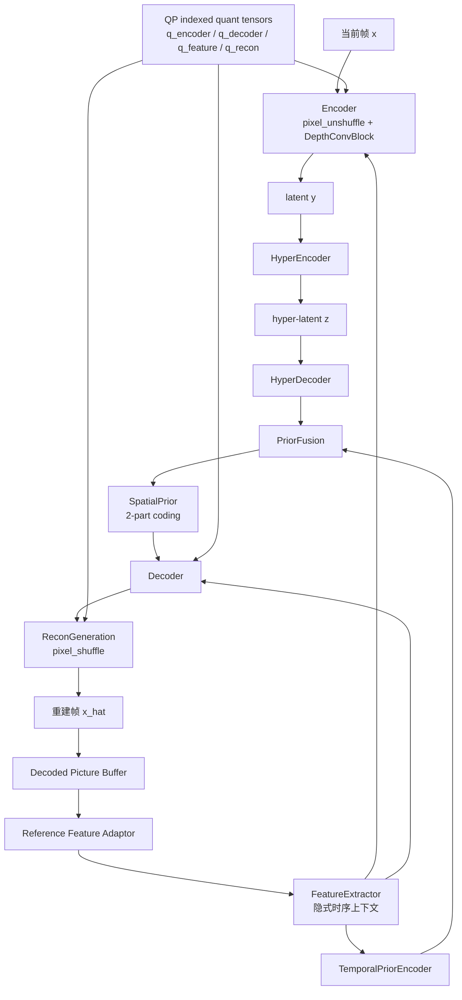

### LIC-HPCM

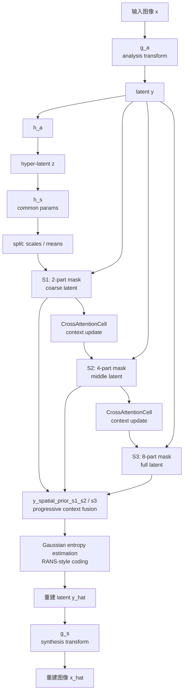

### LIC_TCM

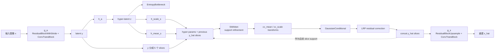

### RwkvCompress / LALIC

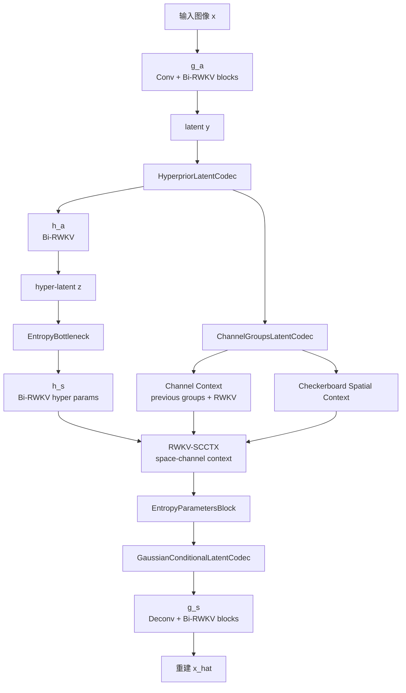

### WeConvene

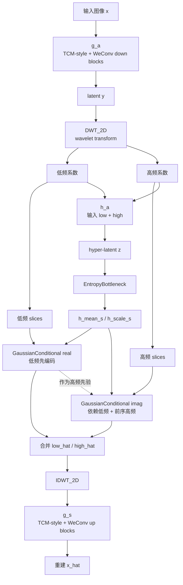

### cuSZ-Hi

```mermaid
flowchart TB
  subgraph Compression["压缩流程 (GPU)"]
    input["输入浮点数据<br/>float32/float64, 1D/2D/3D"]
    pred["Spline3D 多层样条预测<br/>spline_construct"]
    quant["量化误差控制码<br/>[-radius, +radius]"]
    outliers["稀疏异常值收集<br/>outlier compaction"]
    hist["GPU 直方图<br/>p2013Histogram / multiwarp"]
    huffman["Huffman 编码<br/>codebook + bitstream"]
    tcms["TCMS 编码 (无 Huffman 路径)<br/>Transfer-Classify-Merge-Shift"]
    rtr["RTR 二次无损压缩<br/>RLE + TCMS + RZE"]
    bitr["BITR 二次无损压缩<br/>BIT + RRE + RZE"]
    merge["打包 .cusza 归档<br/>Header | VLE | ANCHOR | SPFMT"]
    output["压缩码流 .cusza"]

    input --> pred --> quant --> outliers
    quant --> hist --> huffman --> rtr --> merge --> output
    outliers --> merge
    pred -. "anchor values" .-> merge
    quant -. "无 Huffman 路径" .-> tcms --> bitr --> merge
  end

  subgraph Decompression["解压流程 (GPU)"]
    bitstream["压缩码流 .cusza"]
    parse["解析 Header"]
    rtr_dec["RTR 解压"]
    huff_dec["Huffman 解码 → 误差码"]
    tcms_dec["TCMS 解压 (无 Huffman 路径)"]
    scatter["稀疏值散布<br/>sparse scatter"]
    spline_recon["Spline3D 多层重建<br/>spline_reconstruct"]
    output_data["重建浮点数据"]
    verify["误差界验证<br/>PSNR/NRMSE"]

    bitstream --> parse
    parse --> rtr_dec --> huff_dec --> scatter
    parse -. "无 Huffman 路径" .-> tcms_dec --> scatter
    parse --> scatter
    scatter --> spline_recon --> output_data --> verify
  end
```

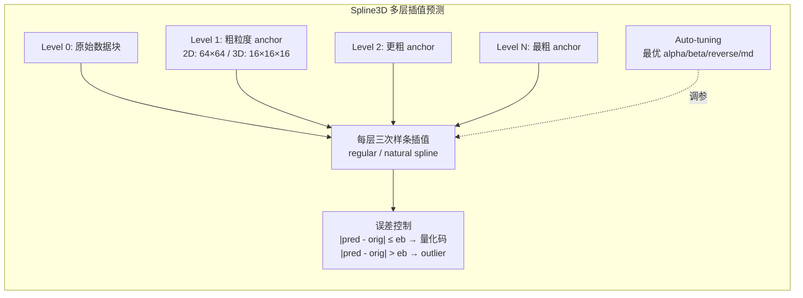

### nvJPEG

```mermaid
flowchart TB
  subgraph Encode["nvJPEG 编码 (GPU)"]
    input["输入图像 x<br/>uint8, [H,W,C] or [H,W]<br/>RGB / 灰度 / YUV"]
    colorspace["颜色空间转换<br/>RGB → YCbCr (可选)"]
    subsample["色度子采样<br/>4:4:4 / 4:2:2 / 4:2:0"]
    dct["8×8 DCT<br/>block-based forward DCT"]
    quant["均匀量化<br/>Q = round(DCT / QTable)"]
    zigzag["之字形扫描<br/>zigzag order reordering"]
    entropy["熵编码<br/>DC: DPCM + Huffman<br/>AC: RLE + Huffman"]
    bitstream["JPEG bitstream"]

    input --> colorspace --> subsample --> dct --> quant --> zigzag --> entropy --> bitstream
  end

  subgraph Decode["nvJPEG 解码 (GPU)"]
    bs["JPEG bitstream"]
    huff_dec["Huffman 解码<br/>恢复 DC/AC 系数"]
    izigzag["逆之字形扫描"]
    iquant["反量化<br/>R = Q × QTable"]
    idct["8×8 IDCT"]
    upsample["色度上采样"]
    ics["颜色空间反转换<br/>YCbCr → RGB"]
    output["重建图像 x_hat<br/>uint8"]

    bs --> huff_dec --> izigzag --> iquant --> idct --> upsample --> ics --> output
  end

  subgraph GPU["CUDA 并行策略"]
    multi_frame["多帧/tile 并行编码"]
    npp["NPP 预处理<br/>颜色空间/子采样"]
    streams["CUDA streams<br/>异步 pipeline"]
    multi_frame --> npp --> streams
  end
```

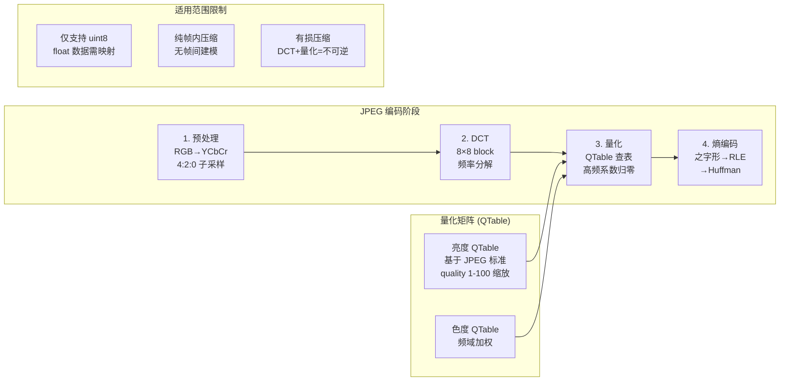

## DCVC-Family 子模型

`models/DCVC` 还包含 `DCVC/DCVC-family`，这是 DCVC 系列的多个早期/扩展编解码器集合。当前工作区主实现是 `DCVC/src` 下的 DCVC-RT；family README 中还列出以下子模型。

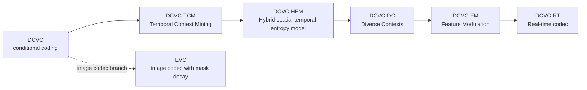

| 子模型 | 类型 | README 中的架构思路 | 本地代码目录 |
|---|---|---|---|
| `DCVC` | 视频编解码器 | Deep Contextual Video Coding，从 residual coding 转向 conditional coding。 | `DCVC/DCVC-family/DCVC` |
| `DCVC-TCM` | 视频编解码器 | Temporal Context Mining，提取更强的多尺度时序上下文。 | `DCVC/DCVC-family/DCVC-TCM` |
| `DCVC-HEM` | 视频编解码器 | Hybrid spatial-temporal entropy model，同时支持单模型码率调节。 | `DCVC/DCVC-family/DCVC-HEM` |
| `DCVC-DC` | 视频编解码器 | Diverse Contexts，在时序和空间两个维度增强条件编码。 | `DCVC/DCVC-family/DCVC-DC` |
| `DCVC-FM` | 视频编解码器 | Feature Modulation，支持宽质量范围和长预测链。 | `DCVC/DCVC-family/DCVC-FM` |
| `DCVC-RT` | 视频编解码器 | Real-time neural video codec，通过效率导向设计降低运行开销，目标是 1080p 100+ FPS。 | 当前工作区主代码 `DCVC/src` |
| `EVC` | 图像编解码器 | Effective variable-bit-rate image codec，使用 mask decay 做可变码率。 | `DCVC/DCVC-family/EVC` |

## 架构细节

### CAESAR

| 方面 | CAESAR-V | CAESAR-D |
|---|---|---|
| 目标 | 直接压缩时空科学数据。 | 只存关键帧，并通过生成式潜空间插值补齐中间帧。 |
| 神经压缩器 | `CompressorMix` 封装 3D/2D 混合 `ResnetCompressor` 和超分模块。 | `ResnetCompressor` 只压缩关键帧。 |
| latent 路径 | Encoder 将 `[B, C, T, H, W]` 转为 latent block；hyper-encoder/decoder 预测 mean 和 scale。 | 关键帧 latent 被解码到 latent 时间线；缺失 latent 帧由 diffusion 采样生成。 |
| 熵编码 | hyper-latent 使用 `FlexiblePrior`，latent 使用条件正态分布，真实 bitstream 通过 `RangeCoder`。 | 对存储的关键帧复用 keyframe compressor 的熵编码路径。 |
| 重建 | 神经解码 + 可选超分，再做误差界后处理。 | 3D U-Net Gaussian diffusion 填补中间 latent 帧，再用 keyframe decoder 重建所有帧。 |

### CRA5

CRA5 (Compressed Representation of ERA5) 是一个针对 ERA5 全球气象再分析数据的**学习式极端压缩模型**，目标是将 ~400+ TiB 的 ERA5 数据压缩到 1 TiB 以下。论文：*"CRA5: Extreme Compression of ERA5 for Portable Global Climate and Weather Research via an Efficient Variational Transformer"* (arXiv:2405.03376)。核心模型 **VAEformer** 是一个基于 ViT backbone 的 VAE + Mean-Scale Hyperprior 架构，可直接处理 268 通道输入。

| 组件 | 实现概述 |
|---|---|
| **主模型 VAEformer** | VAE + Mean-Scale Hyperprior。ViT Encoder/Decoder 各 12 层 (vit_large)，embed_dim=1024。PatchEmbed 用 `Conv2d(268→1024, k=11×10, s=10×10)` 将 268 通道同时映射为 patch token。输入 721×1440 → 输出 73×144 patches。 |
| **Window Attention** | 3 种窗口尺寸轮换：24×24、12×48、48×12，每 4 层切换一次，捕获多尺度空间上下文。含标准 Layer Norm、FFN (MLP+GELU)、残差连接。 |
| **VAE 后验** | Encoder 最后 2 层分别输出 mean 和 logvar，拼接为 2048 维 moments。`DiagonalGaussianDistribution` 做采样/mode；量化后 latent `z_channels=256`，空间 73×144。 |
| **Latent 维度变换** | `quant_conv`: Conv2d(2048→512) 将 (mean+logvar) 映射到 2×256 的分布参数；`post_quant_conv`: Conv2d(256→1024) 恢复 decoder 嵌入维度。 |
| **Hyperprior** | `HyperPriorEncoder h_a`：ViT，patch_size=4×4，embed_dim=360，depth=8，num_heads=5，无 window attention。将 256 维 latent 编码为 hyper-latent z (256 维, 18×36)。`HyperPriorDecoder h_s`：对称结构，`Linear(360→8192)` 输出 scale+mean (2×256×4×4)。 |
| **熵模型** | `EntropyBottleneck(z_channels=256)`：factorized 密度模型，学习 CDF 表，RANS 编码 z。`GaussianConditional`：条件高斯，接收 h_s 输出的 scale/mean，RANS 编码 y。 |
| **训练** | 数据：1998-2017 年 ERA5，batch_size=4，crop=721×1440。损失：rate-distortion (bpp + λ·MSE)，可选 learnable per-channel log-variance MSE 加权。额外 KL 散度 loss。预训练权重：`cra5_268v_300k.pth`。 |
| **268 通道处理** | 直接输入全部 268 通道 (7 气压变量×37 层 + 9 地面变量)。Z-score 逐通道归一化：气压层用 `mean_std.json`，地面变量用 `mean_std_single.json`。这是 CRA5 相比 3 通道通用模型的核心优势——不需要分组处理。 |
| **数据组装** | 从 `pressure.nc` + `single.nc` 配对文件拼接：z/q/u/v/t/r/w × 37 pressure levels + v10/u10/v100/u100/t2m/tcc/sp/tp/msl。`tp` (总降水) 值乘 1000。 |
| **替代模型** | `VaritionInVaration_CNN_Prior`：ViT 编解码 + CNN hyperprior (无 transformer hyperprior)；`MeanScaleHyperprior_Baseline`：无 VAE posterior 变体。经典 CompressAI 模型 (`FactorizedPrior`, `ScaleHyperprior`, `MeanScaleHyperprior`, `JointAutoregressiveHierarchicalPriors`) 也支持但需将 268 通道按 3 通道分组处理。 |
| **API 层** | `cra5_api.py` 提供 `encode_to_latent()` → `latent_to_bin()` → write `.bin` 的完整压缩管线，以及对称解压。`utils.py` 用 `struct.pack/unpack` 做二进制 I/O 序列化。 |
| **关键源码** | `cra5/models/vaeformer/vaeformer.py` (VAEformer 主模型), `cra5/models/vaeformer/vit_nlc.py` (ViT 编解码器), `cra5/models/vaeformer/baseline.py` (替代模型), `cra5/api/cra5_api.py` (高层 API), `cra5/models/compressai/` (定制 CompressAI 库) |

### DCAE

| 组件 | 实现概述 |
|---|---|
| 分析变换 `g_a` | 残差瓶颈下采样阶段 + Swin 风格块；feature dims 为 `[96, 144, 256]`，latent `M=320`。 |
| 合成变换 `g_s` | 反卷积和残差瓶颈上采样，镜像编码器并输出 3 通道图像。 |
| 超先验 | `h_a` 将 `y` 映射到 `z`；两个 hyper decoder `h_z_s1`、`h_z_s2` 产生 latent scale 和 mean。 |
| 字典先验 | 可学习字典 `dt` 有 128 个 entry，每个维度为 `32 * 20`；每个 latent slice 使用 `MutiScaleDictionaryCrossAttentionGLU`。 |
| slice 编码 | `y` 切成 5 个通道 slice；每个 slice 融合 hyper mean/scale、已解码 slice 和字典注意力输出。 |
| 熵模型 | `z` 使用 `EntropyBottleneck(192)`；`y` 使用 `GaussianConditional`；带 `lrp_transforms` 做 latent residual prediction。 |

### LIC_TCM

| 组件 | 实现概述 |
|---|---|
| 主干 | Transformer-CNN Mixture (`ConvTransBlock`) 将卷积分支和 Swin window / shifted-window attention 结合。 |
| 分析 / 合成变换 | `g_a`：残差 stride block + 三个下采样阶段，最终 latent `M=320`；`g_s`：镜像上采样回 RGB。 |
| 超先验 | `h_a`、`h_mean_s`、`h_scale_s` 产生每个 latent 的 mean 和 scale。 |
| 通道级熵模型 | latent `y` 切成 5 个 slice；前序已重建 slice 作为当前 slice 的 support。 |
| 熵模型中的注意力 | `SWAtten` 先细化 mean/scale support，再由小卷积网络预测 Gaussian 参数。 |
| 残差修正 | 每个 slice 使用 latent residual prediction，将有界的 `0.5 * tanh(lrp)` 加到 `y_hat_slice`。 |

### WeConvene

| 组件 | 实现概述 |
|---|---|
| 主干 | TCM 派生的学习式图像压缩器，但部分下采样/上采样残差块换成小波域变体。 |
| 小波变换 | `DWT_2D` / `IDWT_2D`，默认 Haar；latent `y` 被变换成低频和高频系数组。 |
| 超先验 | hyper-analysis 输入拼接后的低/高频小波系数；hyper-synthesis 预测 latent mean/scale。 |
| 熵模型 | 两个 Gaussian conditional：一个用于低频系数，一个用于高频系数。 |
| 编码顺序 | 先编码低频 slice；高频 slice 再依赖低频重建和前序高频 support。 |
| 重建 | 低/高频小波域 `y_hat` 合并后做 inverse wavelet transform，再由 synthesis network 解码。 |

### cuSZ-Hi

cuSZ-Hi 位于 `/data/run01/scxj523/zsh/project/ConvCompression/cuSZ-Hi`，是一个**完全 GPU 加速的误差界有损科学数据压缩器**，属于 SZ 压缩家族。论文发表序列：PACT'20 (cuSZ) → CLUSTER'21 (cuSZ+) → SC'24 (cuSZ-_i_)。核心创新是**多层三次样条插值 (multi-level cubic spline interpolation, Spline3D)** 替代传统 Lorenzo 预测器，实现高压缩比。

| 组件 | 实现概述 |
|---|---|
| **压缩范式** | 预测-量化-熵编码。先用 Spline3D/Lorenzo 做预测，残差量化到有限范围 `[-radius, +radius]`，再用 Huffman 或 TCMS 做无损熵编码。误差界可为绝对或相对模式。 |
| **Spline3D 预测器** | 多层层次插值：2D 数据 6 级 (anchor 64×64)、3D 数据 4 级 (anchor 16×16×16)。每级计算 cubic spline anchor 值，插值中间点。预测误差在界内的量化为 `(val - pred + radius + 0.5)` 取整；越界点作为 outlier 收集到稀疏向量 `(value, index)`。支持 regular 和 natural spline 两种模式，以及正向/反向遍历 (reverse)。alpha 控制 anchor 量化步长，beta 控制预测偏移补偿。 |
| **Auto-tuning** | 压缩器在 GPU 上对 ~100+ 代表数据块采样，试探所有插值参数组合（reverse、natural vs regular、monotonic depth direction `use_md`、alpha/beta），选择最优配置。共 5 种模式：Mode 1 基本 reverse 探测，Mode 2 加 natural/regular 试探，Mode 3 全搜索，Mode 4 alpha/beta 穷举 (11 组)，Mode 5+ 固定预设。 |
| **Huffman 路径 (`-s cr`)** | 默认高压缩比路径。先对量化误差码做 GPU 直方图（p2013Histogram 或 multiwarp 核），构建 Huffman codebook（CPU/GPU 协同），编码为变长 bitstream。打包后对整个归档（Header + VLE + ANCHOR + SPFMT）加一层 RTR（RLE + TCMS + RZE）二次无损压缩。 |
| **TCMS 路径 (`-s tp`)** | 高吞吐无 Huffman 路径。TCMS (Transfer-&-Classify → Merge-&-Shift) 将误差码分段压缩，后续 BIT (Bit-Interleave-Transpose) + RRE 处理。ANCHOR 和 SPFMT 段用 BITR (BIT + RRE + RZE) 编码。 |
| **LC-framework** | Texas State University 的可组合 GPU 无损压缩库。提供 ~50+ 设备端无损变换原语（BIT, RLE, RRE, RZE, TCMS, DIFF, CLOG, TUPL2-8 等），支持 1/2/4/8 字节宽度，全在共享内存中运行。cuSZ-Hi 将其作为无损后端。 |
| **GPU 特性** | CUDA 全 GPU 实现（Spline3D 为 CUDA-only）。支持 sm_80/86/89/90/120 架构。使用 cooperative groups、warp shuffle/ballot/reduce、动态共享内存。Huffman 并行度按 SM 数和 maxThreadsPerBlock 自适应。支持 `cudaStream_t` 异步执行。附带 HIP (AMD) 和 oneAPI (Intel) 后端（Spline3D 除外）。 |
| **归档格式** | `.cusza` 二进制格式：Header（维度、数据类型、误差界、radius、spline 参数、Huffman 标记等） | VLE（变长编码的量化误差码） | ANCHOR（spline anchor 值） | SPFMT（稀疏 outlier 值+索引）。 |
| **Lorenzo 预测器** | 替代预测器 (`--predictor lorenzo`)。基于邻域的滚动差分编码 (1D/2D/3D)，含 outlier 压缩。性能不及 Spline3D 但可用于对比和兼容场景。 |
| **关键源码** | `src/kernel/spline3.cu` (Spline3D 包装+自动调参), `src/kernel/detail/spline3_md.inl` (166KB 核心实现), `src/pipeline/compressor.inl` (压缩/解压管线), `include/compressor.hh` (Compressor 类模板), `src/hf/hfclass.cu` (GPU Huffman 编码), `src/lc/comp-tcms.cu` (TCMS 压缩), `include/cusz.h` (公开 C API) |
| **命令行示例** | `./cuszhi -z -i input.f32 -zlen 360x180x100 -m r2r -e 1e-4 -p spline3 -s cr` |

### nvJPEG

nvJPEG 是 **NVIDIA GPU 加速的标准 JPEG 编解码器**，基于 CUDA 并行化实现。在本项目中作为**传统无损/有损图像压缩 baseline**，主要用于 Kodak、UVG 等图像/视频帧数据的对比测试，对 ERA5 等科学浮点数据仅作为可视化 baseline（因 float→uint8 的不可逆映射引入额外量化误差）。

| 组件 | 实现概述 |
|---|---|
| **编码管线** | 标准 JPEG 四阶段：① 颜色空间转换 (RGB→YCbCr) + 色度子采样 (4:4:4/4:2:2/4:2:0)；② 8×8 block forward DCT 将空间域变换到频域；③ 均匀量化，量化表按 quality 1-100 缩放；④ DC 系数 DPCM + Huffman 编码，AC 系数之字形扫描 + RLE + Huffman 编码。 |
| **解码管线** | 对称逆向：Huffman 解码 → 逆之字形扫描 → 反量化 → 8×8 IDCT → 色度上采样 → YCbCr→RGB。 |
| **量化控制** | 唯一可调参数：quality (1-100)。标准 JPEG 亮度/色度量化表按 quality 缩放因子调整。低 quality → 粗量化 → 高压缩比 → 块效应/振铃 artifact。 |
| **GPU 并行策略** | 多帧/tile 并行：每个 8×8 block 可独立编解码，nvJPEG 利用 CUDA 实现数千 block 并行。NPP 库做颜色空间转换和子采样预处理。支持 CUDA streams 异步 pipeline，可与数据 I/O 重叠。 |
| **输入格式限制** | **仅支持 uint8**（灰度或 RGB）。对 float32 科学数据必须先做 min-max / percentile clipping 到 [0,255]，该步骤不可逆。对 >3 通道数据需通道拆分或选取 3 通道做 RGB composite。 |
| **色度子采样** | 4:4:4（无子采样，最高质量）、4:2:2（水平 2:1）、4:2:0（水平+垂直 2:1，最常用）。子采样利用人眼对色度不敏感的特点额外降低数据量，但会引入颜色模糊。 |
| **在项目中的定位** | 图像数据集 (Kodak, UVG frames) 的传统 baseline，与 General 学习式图像模型对比。对科学数据（显微、遥感、ERA5 等）仅作 visualization baseline，其 float→uint8 映射不可逆，科学指标不在同一物理尺度上比较。 |
| **优势与局限** | 优势：硬件加速、格式通用 (JPEG 兼容)、零训练、性能稳定。局限：仅支持 uint8、无帧间/通道间上下文、块效应明显 (低 quality)、对科学 float 数据不适用。 |

### LIC-HPCM

| 组件 | 实现概述 |
|---|---|
| 变体 | `HPCM_Base`、`HPCM_Large`、`HPCM_Base_PhiContext`；README 重点提供 Base/Large checkpoint 和 Phi-context 变体。 |
| 分析 / 合成变换 | `g_a` 和 `g_s` 是由卷积残差、下采样、上采样 block 构成的学习式图像变换。 |
| 超先验 | `h_a` 编码 side information；`h_s` 输出 common params，再切分成 scales 和 means。 |
| 分层编码 | `forward_hpcm` 通过空间 mask 和重建 mask 生成 S1/S2/S3 三个 latent stage。 |
| 渐进上下文 | S1 使用 2-part 编码；S2 使用 4-part 编码；S3 使用 8-part 编码。早期重建结果会融合到后续 context。 |
| 上下文融合 | `CrossAttentionCell` 在步骤间更新 context；`y_spatial_prior_s1_s2` 和 `y_spatial_prior_s3` 从 common params 与已解码 context 预测 scale/mean。 |
| 熵编码 | `base.py` 中实现自定义 Gaussian entropy estimation 和 RANS 风格编码辅助函数。 |

### RwkvCompress / LALIC

| 组件 | 实现概述 |
|---|---|
| 基类 | `LALIC` 继承 ELIC-2022 风格模型，并将多个模块替换为 Bi-RWKV 线性注意力块。 |
| 分析 / 合成变换 | `g_a` 和 `g_s` 使用 conv/deconv 阶段，并在多个分辨率插入 `RwkvBlock_BiV4`。 |
| 超先验 | `h_a` 和 `h_s` 也使用 Bi-RWKV block。 |
| Bi-RWKV block | 组合 OmniShift、SpatialMix、ChannelMix，用线性注意力风格操作建模 2D latent 特征。 |
| 通道上下文 | latent 通道被分组；每组可以通过 `channel_context` 条件依赖前序组。 |
| 空间上下文 | 每个通道组使用 checkerboard masked convolution 提供空间上下文。 |
| 熵参数聚合 | `EntropyParametersBlock` 融合 hyperprior、channel context 和 spatial context，输出 Gaussian 参数。 |

### DCMVC

| 组件 | 实现概述 |
|---|---|
| I-frame 编码器 | `IntraNoAR` 图像编码器，包含分析/合成变换、hyperprior、four-part spatial prior 和 U-Net refinement。 |
| 运动估计 | `ME_Spynet` 在当前帧和参考帧之间估计光流。 |
| 运动编码 | `MvEnc` / `MvDec` 编码和解码运动矢量，并有独立的 motion hyperprior 与 spatial prior。 |
| 上下文生成 | `OffsetDiversity` 根据光流附近的学习式 offset diversity warp 参考特征；`FeatureExtractor` 构建多尺度 context。 |
| 上下文调制 | Fuse/base/detail 模块和 context fusion 结合像素域、特征域参考信息。 |
| 残差编码 | `ContextualEncoder` 在多尺度 context 条件下编码当前帧；`ContextualDecoder` 解码残差/context 特征。 |
| 重建 | `ReconGeneration` 用 U-Net block 融合 context 和解码残差，输出 P-frame 重建。 |

### DCVC / DCVC-RT

| 组件 | 实现概述 |
|---|---|
| I-frame 编码器 | `DMCI` 图像编码器：先 pixel-unshuffle by 8，再用 depthwise-conv encoder/decoder、hyperprior、4-part spatial prior 和 QP scale。 |
| P-frame 编码器 | `DMC` 视频编码器，带 decoded-picture buffer 和 reference feature adaptor。 |
| 效率设计 | 使用低分辨率源表示（`pixel_unshuffle`）、depthwise conv block、可选 CUDA fused inference path 和紧凑 latent channel。 |
| 时序上下文 | 参考帧/特征先经过 adaptor，再输入 `FeatureExtractor` 作为 temporal context；RT 实现中不走重型显式运动流程。 |
| latent 编码 | Encoder 融合当前帧特征和 temporal context；hyperprior 与 temporal prior 融合后进入 spatial prior 编码。 |
| 码率控制 | 可学习量化张量 `q_encoder`、`q_decoder`、`q_feature`、`q_recon` 按 QP 索引。 |
| 重建 | Decoder 从 `y_hat` 和 context 恢复 feature；`ReconGeneration` 通过 pixel-shuffle 回到图像空间。 |
