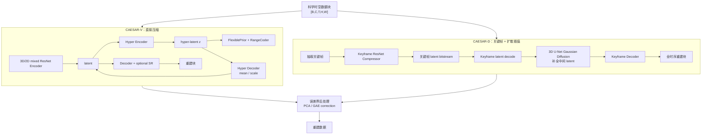
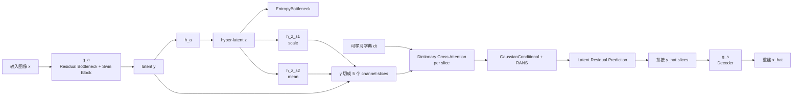
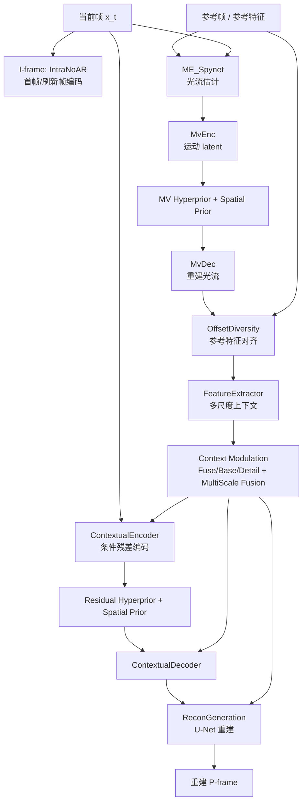
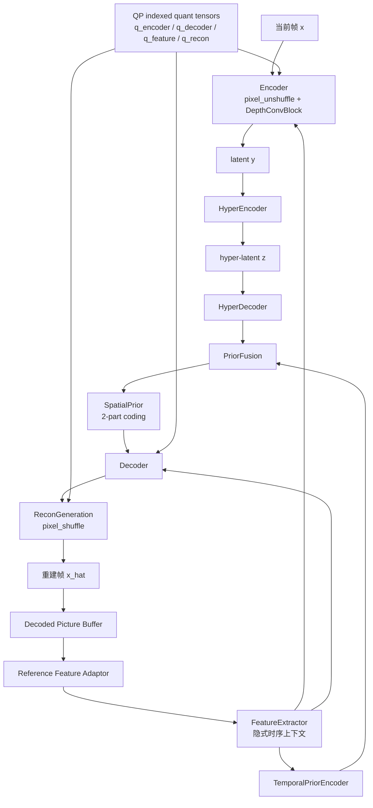
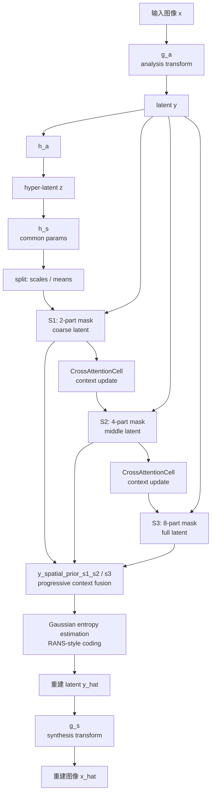
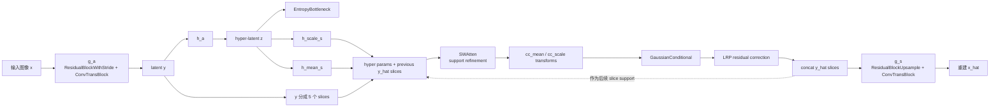
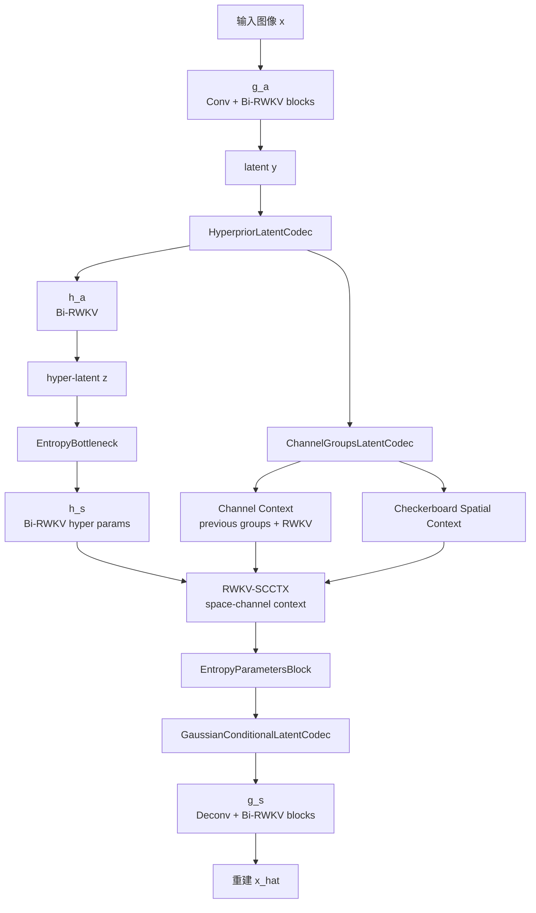
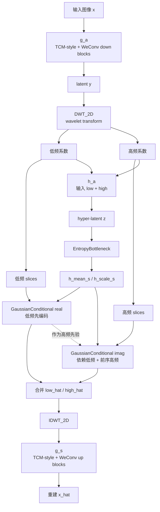
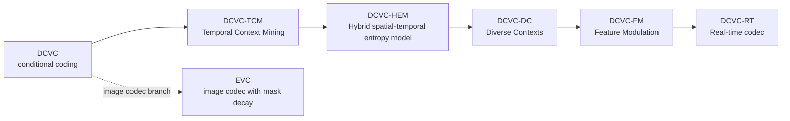

# models 模型架构汇总

> 范围：汇总当前 `models/` 目录下的模型架构，按要求排除 `models/CRA5`。
>
> 说明：本文根据各模型仓库的 README 和本地可读源码整理；架构图使用 Mermaid，可在 GitHub、VS Code 插件或支持 Mermaid 的 Markdown 预览器中渲染。

## 总览表

| 模型目录 | 任务类型 | 主体架构 | 熵模型 / 概率模型 | 时序 / 上下文建模 | 主要源码 |
|---|---|---|---|---|---|
| `CAESAR` | 科学时空数据压缩 | 两个版本：CAESAR-V 使用带尺度超先验和超分模块的 VAE 风格学习式压缩器；CAESAR-D 只压缩关键帧，再用潜空间扩散重建缺失帧。 | `FlexiblePrior` + range coding 编码 latent 和 hyper-latent；神经重建后还有 PCA/GAE 风格的误差界后处理修正。 | CAESAR-V 直接压缩 3D 数据块；CAESAR-D 存储关键帧 latent，并用 3D U-Net Gaussian diffusion 在关键帧之间插值 latent。 | `CAESAR/compressor.py`, `CAESAR/models/compress_modules3d_mid_SR.py`, `CAESAR/models/keyframe_compressor.py`, `CAESAR/models/video_diffusion_interpo.py`, `README.md` |
| `DCAE` | 学习式图像压缩 | Dictionary-based Cross Attention Entropy model。分析/合成变换由残差瓶颈下采样/上采样块、Swin 风格窗口注意力和卷积 GLU 块组成。 | 超先验预测 latent 均值/尺度；`y` 按通道切片，每个 slice 使用可学习字典交叉注意力、Gaussian conditional 编码和 latent residual prediction。 | 图像模型，没有视频时序；上下文主要来自通道 slice 支持、字典先验和超先验。 | `DCAE/models/dcae.py`, `README.md` |
| `DCMVC` | 学习式视频压缩 | Deep Context Modulation 视频编解码器。包含运动估计、运动矢量编码、Offset Diversity 对齐、特征/上下文融合、条件残差编码器/解码器，以及 I-frame 图像压缩器。 | 运动矢量和残差/context latent 各自有 hyperprior/spatial-prior 路径；通过自定义 RANS 工具做算术编码。 | 显式光流 + 像素域/特征域上下文调制；多尺度上下文在 P-frame 条件编码前融合。 | `DCMVC/src/models/DCMVC_model.py`, `DCMVC/src/models/image_model.py`, `README.md` |
| `DCVC` | 实时学习式视频压缩 + DCVC-family 变体 | DCVC-RT 主代码强调低运行开销：pixel-unshuffle 低分辨率 latent、depthwise-conv block、隐式时序建模、类似 module bank 的量化控制；同时包含 intra-frame 图像编码器。 | hyperprior + temporal prior + spatial prior 融合；I-frame 使用 4-part spatial prior，P-frame 使用 2-part prior。 | 使用 decoded picture buffer、自适应参考特征、temporal prior encoder 和 feature extractor，RT 路径中避免重型显式运动模块。 | `DCVC/src/models/video_model.py`, `DCVC/src/models/image_model.py`, `DCVC/README.md`, `DCVC/DCVC-family/README.md` |
| `LIC-HPCM` | 学习式图像压缩 | Hierarchical Progressive Context Modeling。Base/Large 版本使用学习式分析/合成变换，并对 latent 空间分区执行分层编码调度。 | 学习式 hyper mean/scale + Gaussian entropy estimation + progressive context fusion；latent 在 S1/S2/S3 阶段分别用 2-part、4-part、8-part mask 编码。 | 图像模型；通过分层 mask 编码和当前/历史 context 状态之间的 cross-attention 捕获长程上下文。 | `LIC-HPCM/src/models/HPCM_Base.py`, `LIC-HPCM/src/models/HPCM_Large.py`, `LIC-HPCM/src/models/HPCM_Base_PhiContext.py`, `README.md` |
| `LIC_TCM` | 学习式图像压缩 | Mixed Transformer-CNN 架构。分析/合成变换交替使用残差下采样/上采样和 `ConvTransBlock` / Swin 风格窗口注意力块。 | 超先验预测 latent 的 scale/mean；channel-wise entropy model 将 `y` 切成多个 slice，并使用 SWAtten 增强 support 后做 Gaussian conditional 编码和 latent residual prediction。 | 图像模型；上下文来自超先验和已重建的前序通道 slice。 | `LIC_TCM/models/tcm.py`, `README.md` |
| `RwkvCompress` | 学习式图像压缩 | LALIC：在分析/合成变换和 hyperprior 变换中使用 Bi-RWKV 线性注意力块的图像压缩模型。 | ELIC 风格 hyperprior + channel groups + space-channel context model；RWKV-SCCTX 融合通道上下文、checkerboard 空间上下文和超先验参数。 | 图像模型；上下文是 spatial-channel latent context，不涉及视频时序。 | `RwkvCompress/models/lalic.py`, `README.md` |
| `WeConvene` | 学习式图像压缩 | Wavelet-domain convolution and entropy model。基于 TCM 风格 LIC，将部分残差下采样/上采样路径替换为 DWT/IDWT 小波域模块。 | WeChARM 风格小波域 channel-wise autoregressive entropy model；低频和高频系数分别使用独立 Gaussian conditional。 | 图像模型；先编码低频，再让高频依赖低频重建结果和前序高频 slice。 | `WeConvene/model/tcm_wave_residual_two_entropy_modified_y_downsample_8.py`, `README.md` |

## 架构图总览

### CAESAR

### DCAE

### DCMVC

### DCVC / DCVC-RT

### LIC-HPCM

### LIC_TCM

### RwkvCompress / LALIC

### WeConvene

## DCVC-Family 子模型

`models/DCVC` 还包含 `DCVC/DCVC-family`，这是 DCVC 系列的多个早期/扩展编解码器集合。当前工作区主实现是 `DCVC/src` 下的 DCVC-RT；family README 中还列出以下子模型。

| 子模型 | 类型 | README 中的架构思路 | 本地代码目录 |
|---|---|---|---|
| `DCVC` | 视频编解码器 | Deep Contextual Video Coding，从 residual coding 转向 conditional coding。 | `DCVC/DCVC-family/DCVC` |
| `DCVC-TCM` | 视频编解码器 | Temporal Context Mining，提取更强的多尺度时序上下文。 | `DCVC/DCVC-family/DCVC-TCM` |
| `DCVC-HEM` | 视频编解码器 | Hybrid spatial-temporal entropy model，同时支持单模型码率调节。 | `DCVC/DCVC-family/DCVC-HEM` |
| `DCVC-DC` | 视频编解码器 | Diverse Contexts，在时序和空间两个维度增强条件编码。 | `DCVC/DCVC-family/DCVC-DC` |
| `DCVC-FM` | 视频编解码器 | Feature Modulation，支持宽质量范围和长预测链。 | `DCVC/DCVC-family/DCVC-FM` |
| `DCVC-RT` | 视频编解码器 | Real-time neural video codec，通过效率导向设计降低运行开销，目标是 1080p 100+ FPS。 | 当前工作区主代码 `DCVC/src` |
| `EVC` | 图像编解码器 | Effective variable-bit-rate image codec，使用 mask decay 做可变码率。 | `DCVC/DCVC-family/EVC` |

## 架构细节

### CAESAR

| 方面 | CAESAR-V | CAESAR-D |
|---|---|---|
| 目标 | 直接压缩时空科学数据。 | 只存关键帧，并通过生成式潜空间插值补齐中间帧。 |
| 神经压缩器 | `CompressorMix` 封装 3D/2D 混合 `ResnetCompressor` 和超分模块。 | `ResnetCompressor` 只压缩关键帧。 |
| latent 路径 | Encoder 将 `[B, C, T, H, W]` 转为 latent block；hyper-encoder/decoder 预测 mean 和 scale。 | 关键帧 latent 被解码到 latent 时间线；缺失 latent 帧由 diffusion 采样生成。 |
| 熵编码 | hyper-latent 使用 `FlexiblePrior`，latent 使用条件正态分布，真实 bitstream 通过 `RangeCoder`。 | 对存储的关键帧复用 keyframe compressor 的熵编码路径。 |
| 重建 | 神经解码 + 可选超分，再做误差界后处理。 | 3D U-Net Gaussian diffusion 填补中间 latent 帧，再用 keyframe decoder 重建所有帧。 |

### DCAE

| 组件 | 实现概述 |
|---|---|
| 分析变换 `g_a` | 残差瓶颈下采样阶段 + Swin 风格块；feature dims 为 `[96, 144, 256]`，latent `M=320`。 |
| 合成变换 `g_s` | 反卷积和残差瓶颈上采样，镜像编码器并输出 3 通道图像。 |
| 超先验 | `h_a` 将 `y` 映射到 `z`；两个 hyper decoder `h_z_s1`、`h_z_s2` 产生 latent scale 和 mean。 |
| 字典先验 | 可学习字典 `dt` 有 128 个 entry，每个维度为 `32 * 20`；每个 latent slice 使用 `MutiScaleDictionaryCrossAttentionGLU`。 |
| slice 编码 | `y` 切成 5 个通道 slice；每个 slice 融合 hyper mean/scale、已解码 slice 和字典注意力输出。 |
| 熵模型 | `z` 使用 `EntropyBottleneck(192)`；`y` 使用 `GaussianConditional`；带 `lrp_transforms` 做 latent residual prediction。 |

### LIC_TCM

| 组件 | 实现概述 |
|---|---|
| 主干 | Transformer-CNN Mixture (`ConvTransBlock`) 将卷积分支和 Swin window / shifted-window attention 结合。 |
| 分析 / 合成变换 | `g_a`：残差 stride block + 三个下采样阶段，最终 latent `M=320`；`g_s`：镜像上采样回 RGB。 |
| 超先验 | `h_a`、`h_mean_s`、`h_scale_s` 产生每个 latent 的 mean 和 scale。 |
| 通道级熵模型 | latent `y` 切成 5 个 slice；前序已重建 slice 作为当前 slice 的 support。 |
| 熵模型中的注意力 | `SWAtten` 先细化 mean/scale support，再由小卷积网络预测 Gaussian 参数。 |
| 残差修正 | 每个 slice 使用 latent residual prediction，将有界的 `0.5 * tanh(lrp)` 加到 `y_hat_slice`。 |

### WeConvene

| 组件 | 实现概述 |
|---|---|
| 主干 | TCM 派生的学习式图像压缩器，但部分下采样/上采样残差块换成小波域变体。 |
| 小波变换 | `DWT_2D` / `IDWT_2D`，默认 Haar；latent `y` 被变换成低频和高频系数组。 |
| 超先验 | hyper-analysis 输入拼接后的低/高频小波系数；hyper-synthesis 预测 latent mean/scale。 |
| 熵模型 | 两个 Gaussian conditional：一个用于低频系数，一个用于高频系数。 |
| 编码顺序 | 先编码低频 slice；高频 slice 再依赖低频重建和前序高频 support。 |
| 重建 | 低/高频小波域 `y_hat` 合并后做 inverse wavelet transform，再由 synthesis network 解码。 |

### LIC-HPCM

| 组件 | 实现概述 |
|---|---|
| 变体 | `HPCM_Base`、`HPCM_Large`、`HPCM_Base_PhiContext`；README 重点提供 Base/Large checkpoint 和 Phi-context 变体。 |
| 分析 / 合成变换 | `g_a` 和 `g_s` 是由卷积残差、下采样、上采样 block 构成的学习式图像变换。 |
| 超先验 | `h_a` 编码 side information；`h_s` 输出 common params，再切分成 scales 和 means。 |
| 分层编码 | `forward_hpcm` 通过空间 mask 和重建 mask 生成 S1/S2/S3 三个 latent stage。 |
| 渐进上下文 | S1 使用 2-part 编码；S2 使用 4-part 编码；S3 使用 8-part 编码。早期重建结果会融合到后续 context。 |
| 上下文融合 | `CrossAttentionCell` 在步骤间更新 context；`y_spatial_prior_s1_s2` 和 `y_spatial_prior_s3` 从 common params 与已解码 context 预测 scale/mean。 |
| 熵编码 | `base.py` 中实现自定义 Gaussian entropy estimation 和 RANS 风格编码辅助函数。 |

### RwkvCompress / LALIC

| 组件 | 实现概述 |
|---|---|
| 基类 | `LALIC` 继承 ELIC-2022 风格模型，并将多个模块替换为 Bi-RWKV 线性注意力块。 |
| 分析 / 合成变换 | `g_a` 和 `g_s` 使用 conv/deconv 阶段，并在多个分辨率插入 `RwkvBlock_BiV4`。 |
| 超先验 | `h_a` 和 `h_s` 也使用 Bi-RWKV block。 |
| Bi-RWKV block | 组合 OmniShift、SpatialMix、ChannelMix，用线性注意力风格操作建模 2D latent 特征。 |
| 通道上下文 | latent 通道被分组；每组可以通过 `channel_context` 条件依赖前序组。 |
| 空间上下文 | 每个通道组使用 checkerboard masked convolution 提供空间上下文。 |
| 熵参数聚合 | `EntropyParametersBlock` 融合 hyperprior、channel context 和 spatial context，输出 Gaussian 参数。 |

### DCMVC

| 组件 | 实现概述 |
|---|---|
| I-frame 编码器 | `IntraNoAR` 图像编码器，包含分析/合成变换、hyperprior、four-part spatial prior 和 U-Net refinement。 |
| 运动估计 | `ME_Spynet` 在当前帧和参考帧之间估计光流。 |
| 运动编码 | `MvEnc` / `MvDec` 编码和解码运动矢量，并有独立的 motion hyperprior 与 spatial prior。 |
| 上下文生成 | `OffsetDiversity` 根据光流附近的学习式 offset diversity warp 参考特征；`FeatureExtractor` 构建多尺度 context。 |
| 上下文调制 | Fuse/base/detail 模块和 context fusion 结合像素域、特征域参考信息。 |
| 残差编码 | `ContextualEncoder` 在多尺度 context 条件下编码当前帧；`ContextualDecoder` 解码残差/context 特征。 |
| 重建 | `ReconGeneration` 用 U-Net block 融合 context 和解码残差，输出 P-frame 重建。 |

### DCVC / DCVC-RT

| 组件 | 实现概述 |
|---|---|
| I-frame 编码器 | `DMCI` 图像编码器：先 pixel-unshuffle by 8，再用 depthwise-conv encoder/decoder、hyperprior、4-part spatial prior 和 QP scale。 |
| P-frame 编码器 | `DMC` 视频编码器，带 decoded-picture buffer 和 reference feature adaptor。 |
| 效率设计 | 使用低分辨率源表示（`pixel_unshuffle`）、depthwise conv block、可选 CUDA fused inference path 和紧凑 latent channel。 |
| 时序上下文 | 参考帧/特征先经过 adaptor，再输入 `FeatureExtractor` 作为 temporal context；RT 实现中不走重型显式运动流程。 |
| latent 编码 | Encoder 融合当前帧特征和 temporal context；hyperprior 与 temporal prior 融合后进入 spatial prior 编码。 |
| 码率控制 | 可学习量化张量 `q_encoder`、`q_decoder`、`q_feature`、`q_recon` 按 QP 索引。 |
| 重建 | Decoder 从 `y_hat` 和 context 恢复 feature；`ReconGeneration` 通过 pixel-shuffle 回到图像空间。 |
